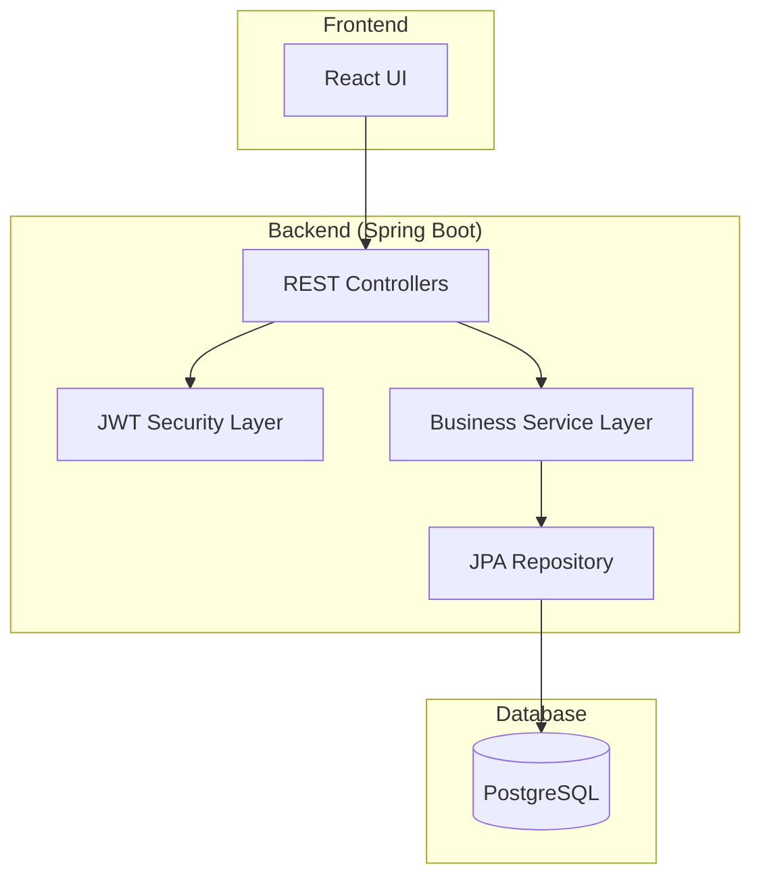
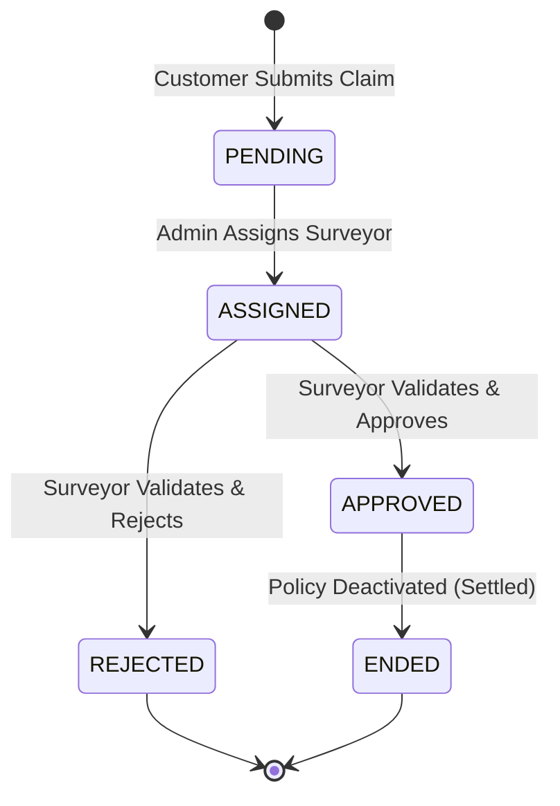

# 🛡️ Insurance Claim Management System

### Enterprise-Grade Claim Processing & Policy Workflow Platform

A production-ready full-stack system designed to manage the end-to-end lifecycle of insurance policies and claims with strict business rule enforcement, role-based workflows, and scalable REST APIs.

---

## 🏗️ System Architecture

The platform follows a layered **MVC architecture** with centralized data persistence and role-based access control (RBAC).

### 🔄 Claim Lifecycle Flow

---

## 💎 Key Modules

### 1. Role-Based Access Control (RBAC)
- Implements secure authentication and authorization using **JWT (JSON Web Tokens)**.
- **Roles**: 
    - `Customer`: Can view/apply for policies and raise/track claims.
    - `Admin`: Full system control (Policy creation, Surveyor assignment, Application approval).
    - `Surveyor`: Responsible for inspecting and approving/rejecting assigned claims.
- Fine-grained access control at both API and UI layers.

### 2. Claim Lifecycle Engine
- Strict state transitions: `PENDING` → `ASSIGNED` → `APPROVED/REJECTED`.
- Prevents re-assignment once a claim is in process.
- Tracks `approvedAmount`, `fraudSuspected`, and `fraudNotes` for every claim.

### 3. Policy Validation & Management
- **Automated Eligibility**: Blocks new policy applications if an active claim or pending application exists.
- **Coverage Enforcement**: Ensures claim amounts never exceed policy limits.
- **Status Lifecycle**: Handles policy transitions from `PENDING` to `ACTIVE` to `ENDED` (post-claim) or `EXPIRED`.

### 4. Surveyor Assignment System
- Admin-controlled workflow for assigning dedicated surveyors to submitted claims.
- Integrated dashboard for surveyors to view and process their specific assignments.

---

## 🛠️ Tech Stack

| Layer | Technologies |
| :--- | :--- |
| **Frontend** | React, Vite, React Router, Context API, CSS3 |
| **Backend** | Spring Boot (Java 17), Spring Data JPA, REST APIs |
| **Database** | PostgreSQL |
| **Security** | Spring Security, JWT (Stateless Auth) |
| **Architecture** | MVC, Layered Architecture, DTO Pattern |

---

## 🧱 Backend Structure (Spring Boot)

### 📦 Entities
- `Users`: Central user model with roles (`ADMIN`, `CUSTOMER`, `SURVEYOR`).
- `Policy`: Defines available insurance products and coverage limits.
- `CustomerPolicy`: Tracks the link between users and their purchased policies.
- `Claim`: Represents a claim request with status and surveyor details.
- `PolicyCoverage`: Itemized coverage details for specific policies.

### 📦 Business Logic (Services)
- `AuthService`: Handles registration and secure login.
- `CustomerService`: Manages policy applications and claim submissions.
- `AdminService`: Handles system-level configurations and assignments.
- `SurveyorService`: Manages the claim inspection and approval pipeline.

### 🔐 Security Architecture
- `JwtUtil`: Token generation and validation logic.
- `JwtAuthenticationFilter`: Custom filter for intercepting and validating JWT in headers.
- `SecurityConfig`: Configures CORS, CSRF, and role-based endpoint protection.

---

## 🔑 Key Business Rules

> [!IMPORTANT]
> **Claim Integrity**: A claim cannot be re-assigned to another surveyor once it has been `ASSIGNED`, `APPROVED`, or `REJECTED`.

- **Policy Exclusivity**: A customer cannot apply for a new policy if they have an active claim (`PENDING`, `ASSIGNED`, `APPROVED`) or a pending policy application.
- **Coverage Limits**: Claim and Approval amounts are strictly validated against the policy's maximum coverage limit.
- **Post-Settlement Logic**: Once a claim is `APPROVED`, the associated policy status is automatically set to `ENDED`.
- **Ownership Security**: Customers can only raise or view claims for policies they explicitly own.

